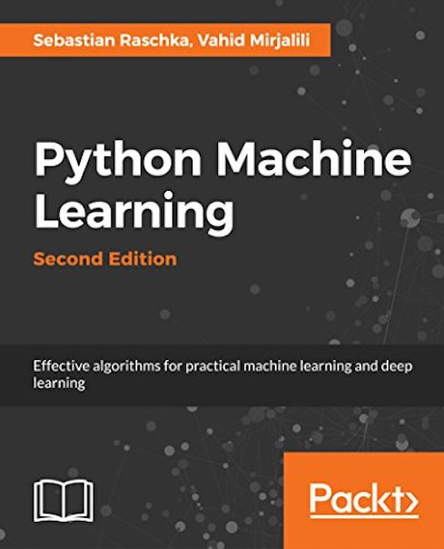
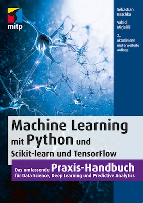
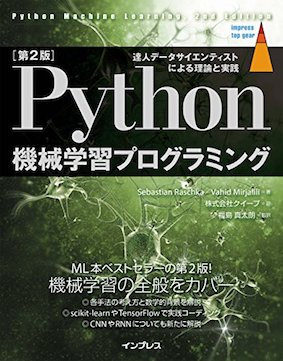

## Python Machine Learning (2nd Ed.) Code Repository

**Python Machine Learning, 2nd Ed.**  

published September 20th, 2017

Paperback: 622 pages  
Publisher: Packt Publishing  
Language: English

ISBN-10: 1787125939  
ISBN-13: 978-1787125933  
Kindle ASIN: B0742K7HYF  

## Links

- [Amazon Page](https://www.amazon.com/Python-Machine-Learning-scikit-learn-TensorFlow/dp/1787125939)
- [Packt Page](https://www.packtpub.com/big-data-and-business-intelligence/python-machine-learning-second-edition)

## Table of Contents and Code Notebooks

**Helpful installation and setup instructions can be found in the [README.md file of Chapter 1](code/ch01/README.md)**

To access the code materials for a given chapter, simply click on the `open dir` links next to the chapter headlines to navigate to the chapter subdirectories located in the [code/](code/) subdirectory. You can also click on the `ipynb` links below to open and view the Jupyter notebook of each chapter directly on GitHub.

In addition, the [code/](code/) subdirectories also contain .py script files, which were created from the Jupyter Notebooks. However, I highly recommend working with the Jupyter notebook if possible in your computing environment. Not only do the Jupyter notebooks contain the images and section headings for easier navigation, but they also allow for a stepwise execution of individual code snippets, which -- in my opinion -- provide a better learning experience.

**Please note that these are just the code examples accompanying the book, which I uploaded for your convenience; be aware that these notebooks may not be useful without the formulae and descriptive text.**   

1. Machine Learning - Giving Computers the Ability to Learn from Data [[open dir](./code/ch01)] [[ipynb](./code/ch01/ch01.ipynb)] 
2. Training Machine Learning Algorithms for Classification [[open dir](./code/ch02)] [[ipynb](./code/ch02/ch02.ipynb)] 
3. A Tour of Machine Learning Classifiers Using Scikit-Learn [[open dir](./code/ch03)] [[ipynb](./code/ch03/ch03.ipynb)] 
4. Building Good Training Sets – Data Pre-Processing [[open dir](./code/ch04)] [[ipynb](./code/ch04/ch04.ipynb)] 
5. Compressing Data via Dimensionality Reduction [[open dir](./code/ch05)] [[ipynb](./code/ch05/ch05.ipynb)] 
6. Learning Best Practices for Model Evaluation and Hyperparameter Optimization [[open dir](./code/ch06)] [[ipynb](./code/ch06/ch06.ipynb)]
7. Combining Different Models for Ensemble Learning [[open dir](./code/ch07)] [[ipynb](./code/ch07/ch07.ipynb)]
8. Applying Machine Learning to Sentiment Analysis [[open dir](./code/ch08)] [[ipynb](./code/ch08/ch08.ipynb)] 
9. Embedding a Machine Learning Model into a Web Application [[open dir](./code/ch09)] [[ipynb](./code/ch09/ch09.ipynb)] 
10. Predicting Continuous Target Variables with Regression Analysis [[open dir](./code/ch10)] [[ipynb](./code/ch10/ch10.ipynb)] 
11. Working with Unlabeled Data – Clustering Analysis [[open dir](./code/ch11)] [[ipynb](./code/ch11/ch11.ipynb)] 
12. Implementing a Multi-layer Artificial Neural Network from Scratch [[open dir](./code/ch12)] [[ipynb](./code/ch12/ch12.ipynb)] 
13. Parallelizing Neural Network Training with TensorFlow [[open dir](./code/ch13)] [[ipynb](./code/ch13/ch13.ipynb)] 
14. Going Deeper: The Mechanics of TensorFlow [[open dir](./code/ch14)] [[ipynb](./code/ch14/ch14.ipynb)] 
15. Classifying Images with Deep Convolutional Neural Networks [[open dir](./code/ch15)] [[ipynb](./code/ch15/ch15.ipynb)] 
16. Modeling Sequential Data Using Recurrent Neural Networks [[open dir](./code/ch16)] [[ipynb](./code/ch16/ch16.ipynb)] 

### What’s new in the second edition from the first edition?

> Oh, there are so many things that we improved or added; where should I start!? The one issue on top of my priority list was to fix all the nasty typos that were introduced during the layout stage or my oversight. I really appreciated all the helpful feedback from readers in this manner! Furthermore, I addressed all the feedback about sections that may have been confusing or a bit unclear, reworded paragraphs, and added additional explanations. Also, special thanks go to the excellent editors of the second edition, who helped a lot along the way! 

> Also, the figures and plots became much prettier. While readers liked the graphic content a lot, some people criticized the PowerPoint-esque style and layout. Thus, I decided to overhaul every little figure with a hopefully more pleasing choice of fonts and colors. Also, the data plots look much nicer now, thanks to the matplotlib team who put a lot of work in matplotlib 2.0 and its new styling theme.

> Beyond all these cosmetic fixes, new sections were added here and there. Among these is, for example, is a section on dealing with imbalanced datasets, which several readers were missing in the first edition and short section on Latent Dirichlet Allocation among others.

> As time and the software world moved on after the first edition was released in September 2015, we decided to replace the introduction to deep learning via Theano. No worries, we didn't remove it but it got a substantial overhaul and is now based on TensorFlow, which has become a major player in my research toolbox since its open source release by Google in November 2015. 
Along with the new introduction to deep learning using TensorFlow, the biggest additions to this new edition are three brand new chapters focussing on deep learning applications: A more detailed overview of the TensorFlow mechanics, an introduction to convolutional neural networks for image classification, and an introduction to recurrent neural networks for natural language processing. Of course, and in a similar vein as the rest of the book, these new chapters do not only provide readers with practical instructions and examples but also introduce the fundamental mathematics behind those concepts, which are an essential building block for understanding how deep learning works.

[ [Excerpt from "Machine Learning can be useful in almost every problem domain:" An interview with Sebastian Raschka](https://www.packtpub.com/books/content/machine-learning-useful-every-problem-domain-interview-sebastian-raschka/) ]

--- 

 
 

Raschka, Sebastian, and Vahid Mirjalili. *Python Machine Learning, 2nd Ed*. Packt Publishing, 2017.

    @book{RaschkaMirjalili2017,  
    address = {Birmingham, UK},  
    author = {Raschka, Sebastian and Mirjalili, Vahid},  
    edition = {2},  
    isbn = {978-1787125933},  
    keywords = {Clustering,Data Science,Deep Learning,  
                Machine Learning,Neural Networks,Programming,  
                Supervised Learning},  
    publisher = {Packt Publishing},  
    title = {{Python Machine Learning, 2nd Ed.}},  
    year = {2017}  
    }

# Translations

### German

- ISBN-10: 3958457339
- ISBN-13: 978-3958457331
- [Amazon.de link](https://www.amazon.de/Machine-Learning-Python-Scikit-Learn-TensorFlow/dp/3958457339/ref=tmm_pap_swatch_0?_encoding=UTF8&qid=1513601461&sr=8-5)
- [Publisher link](https://mitp.de/IT-WEB/Programmierung/Machine-Learning-mit-Python-oxid.html)

### Japanese

- ISBN-10: 4295003379
- ISBN-13: 978-4295003373
- [Amazon.co.jp link](https://www.amazon.co.jp/Python-機械学習プログラミング-達人データサイエンティストによる理論と実践-impress-gear/dp/4295003379/ref=tmm_pap_swatch_0)

