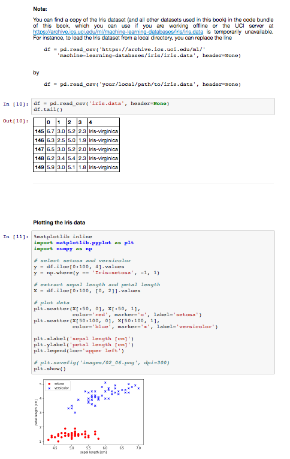
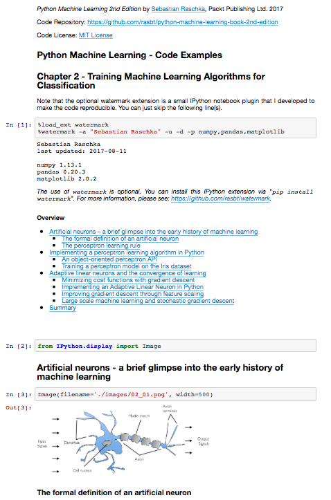

Python Machine Learning - Code Examples

##  Chapter 10: Predicting Continuous Target Variables with Regression Analysis

### Chapter Outline

- Introducing linear regression
  - Simple linear regression
  - Multiple linear regression
- Exploring the Housing dataset
  - Loading the Housing dataset into a data frame
  - Visualizing the important characteristics of a dataset
  - Looking at relationships using a correlation matrix
- Implementing an ordinary least squares linear regression model
  - Solving regression for regression parameters with gradient descent
  - Estimating coef cient of a regression model via scikit-learn
- Fitting a robust regression model using RANSAC
- Evaluating the performance of linear regression models
- Using regularized methods for regression 
- Turning a linear regression model into a curve – polynomial
regression
  - Adding polynomial terms using scikit-learn
  - Modeling nonlinear relationships in the Housing dataset
- Dealing with nonlinear relationships using random forests
  - Decision tree regression
  - Random forest regression
- Summary

### A note on using the code examples

The recommended way to interact with the code examples in this book is via Jupyter Notebook (the `.ipynb` files). Using Jupyter Notebook, you will be able to execute the code step by step and have all the resulting outputs (including plots and images) all in one convenient document.

Setting up Jupyter Notebook is really easy: if you are using the Anaconda Python distribution, all you need to install jupyter notebook is to execute the following command in your terminal:

    conda install jupyter notebook

Then you can launch jupyter notebook by executing

    jupyter notebook

A window will open up in your browser, which you can then use to navigate to the target directory that contains the `.ipynb` file you wish to open.

**More installation and setup instructions can be found in the [README.md file of Chapter 1](../ch01/README.md)**.

**(Even if you decide not to install Jupyter Notebook, note that you can also view the notebook files on GitHub by simply clicking on them: [`ch10.ipynb`](ch10.ipynb))**

In addition to the code examples, I added a table of contents to each Jupyter notebook as well as section headers that are consistent with the content of the book. Also, I included the original images and figures in hope that these make it easier to navigate and work with the code interactively as you are reading the book.

When I was creating these notebooks, I was hoping to make your reading (and coding) experience as convenient as possible! However, if you don't wish to use Jupyter Notebooks, I also converted these notebooks to regular Python script files (`.py` files) that can be viewed and edited in any plaintext editor. 