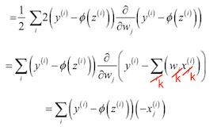
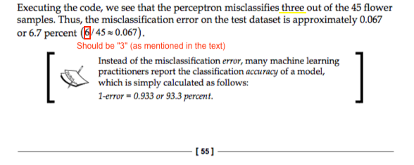
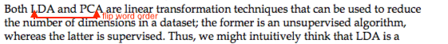
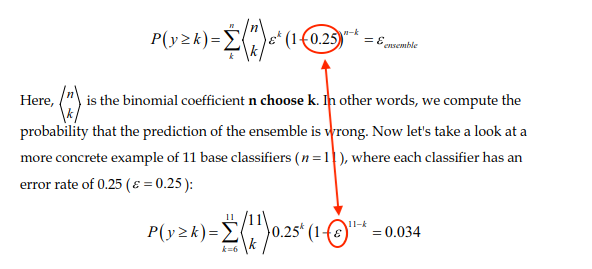
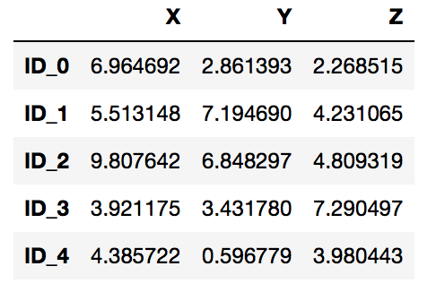
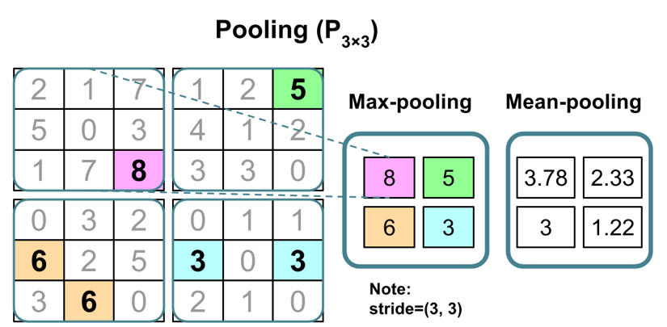

Dear Readers, 

again, I tried my best to cut all the little typos, errors, and formatting bugs that slipped through the copy editing stage. Even so, while I think it is just human to have a little typo here and there, I know that this can be quite annoying as a reader!

To turn those annoyances into something positive, I will donate $5 to [UNICEF USA](https://www.unicefusa.org), the US branch of the United Nations agency for raising funds to provide emergency food and healthcare for children in developing countries, for each little, previously unreported buglet you find and submit to the issue tracker.

Also below, I added a small leaderboard to keep track of the errata submissions and errors you found. Please let me know if you don't want to be explicitely mentioned in that list! 


- Amount for the next donation: 90$
- Amount donated: 0$


---


Contributor list:

6. Oliver Tomic ($20)
7. gabramson ($15)
1. Gogy ($10)
12. Haesun Park ($10)
2. Christian Geier ($5)
3. Pieter Algra / Carlos Zada ($5)
4. @gabramson ($5)
5. Elias Strehle ($5)
7. Krishna Mohan ($5)
8. Jesse Blocher ($5)
9. Elie Kawerk ($5)
10. Dejan Stepec ($5)
11. Poon Ho Chuen ($5)


<br>
<br>
<br>
<br>


---

### Errata

pg. 13

It says "and and open source community" on this page -- 1x "and" should be enough.

pg. 18

"McCullock" should me spelled "McCulloch."

pg. 28

In the code example in the info box (`sum([j * j for i, j in zip(a, b)])`), it should be `i * j`, not `‘`j * j`’`; otherwise, we would be calculating b^T b, not a^T b.

pg. 37

The existing indices shouldn't be reused:




pg. 55



pg. 56

Earlier prints of the book had a chapter reference in the info box: 

> In ~Chapter 5, Compressing Data via Dimensionality Reduction~ {Chapter 6: Learning Best Practices for Model Evaluation and Hyperparameter Tuning}, you will learn about useful techniques, including graphical analysis such as learning curves, to detect and prevent overfitting.

pg. 81

On pg. 81, I incorrectly state that the `Perceptron` class uses LIBLINEAR. It uses a regular SGD implementation instead for optimization.

pg. 91

On the top of the page, it says "Here, p (i | t ) is the proportion of the samples that belong to class c." The "*c*" should be changed to *i*.

pg. 99

There is a wrong chapter reference at the bottom of this page. It should be *Chapter 6* and not *Chapter 5*.

pg. 101

The text description references "entropy" as the impurity criterion being used in the `RandomForestClassifier`. However, `"gini"` is used in the code example, and thus "entropy" should be changed to "gini" in the text as well.

pg. 136

The print version is incorrectly shows 

```python
>>> plt.xticks(range(X_train.shape[1]),
...            feat_labels, rotation=90)
```

instead of 

```python
>>> plt.xticks(range(X_train.shape[1]),
...            feat_labels[indices], rotation=90)
```

It seems that I did it correctly in the notebook. Also, the list of feature importances and the plot seem to be correct in the book. However, somehow the [indices] array index went missing in the print version.

Also, it says "10,000 trees" in the text, but it should be "500 trees" to be consistent with the code.  

pg. 138

Instead of writing

```
 >>> print('Number of samples that meet this criterion:',
   ...       X_selected.shape[0])
   Number of samples that meet this criterion: 124
```

it would make more sense to write

```
 >>> print('Number of features that meet this threshold criterion:',
   ...       X_selected.shape[1])
   Number of features that meet this threshold criterion: 5
```


pg. 155



pg. 221

There's been a mix-up, the epsilon and the 0.25 should be swapped



pg. 283

The documentation of `joblib` has recently moved to a new webpage and previous address (http://pythonhosted.org/joblib/) is no longer valid. The new web address for the documentation is https://joblib.readthedocs.io.

pg. 340

The second paragraph (right under the equation) starts with "Here, x is the feature ..." Instead of "x" it should be "x_i" ("x" with a subscript "i")
 
pg. 344

> Unfortunately, there is ~now~ {not} a universal approach for dealing with non-randomness in residual plots, and it requires experimentation

pg. 368

An error occurred so that the figure from the previous page was duplicated instead of inserting the pairwise distance matrix. Below, the correct figure is shown (note that all Jupyter Notebooks contain the correct figures):



pg. 366

> The first and second columns denote the most dissimilar members in each cluster, and the third ~row~ {column} reports the distance between those members.

pg. 371

> As we can see, in this pruned clustering hierarchy, label ID_3 was ~not~ assigned to the same cluster as ID_0 and ID_4, as expected.

pg. 506

An error during the layout ocurred so that a figure was duplicated. Below, the correct figure is shown (note that all Jupyter Notebooks contain the correct figures):



